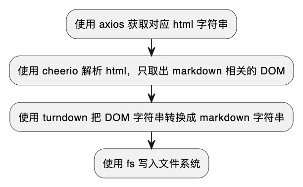

# 爬取技术文档并转为 markdown

## 背景

我们团队封装的工具库中引入了 lodash ，但工具库文档中并没有 lodash 相关函数说明，我找到了其  [英文官方文档](https://lodash.com/docs/4.17.15) 与 [中文社区文档](https://www.lodashjs.com/)，期望是能把中文文档放到我们的仓库中，我以为 [中文社区文档](https://www.lodashjs.com/) 会在 GitHub 上开源，但是苦苦搜寻都没有找到原内容，所以决定爬取一下 html，之后转换成 markdown


## 流程图


::: details 流程图代码

[流程图链接](https://www.plantuml.com/plantuml/uml/SoWkIImgAStDuR9widV_yoah518hClEB5LxqRN_QF-tf-frFTqrHo2Z9pL5ukdRwypNBdkpOP0rNcfoHcbgKcQ_mOldYP_CcW9MztzFpj7yLI6lxBeNSnABibFpoF8NditSyRTtyV5QBWek_Bq9_IMbH7bZ-MLSNI0PXnukzQvxrBdhMCG5k1ZRxqueLdhRDVDgwzDcqzYUxjptVlFlvxldMN0wfUIb07m40)

```
@startuml
:使用 axios 获取对应 html 字符串;
:使用 cheerio 解析 html，只取出 markdown 相关的 DOM;
:使用 turndown 把 DOM 字符串转换成 markdown 字符串;
:使用 fs 写入文件系统;
@enduml
```

:::





## 代码

[代码链接](https://bitbucket.org/acdoc/doc-pup/src/main/a.js)

```js
const axios = require('axios');
const cheerio = require('cheerio');
const TurndownService = require('turndown')
const fs = require('fs');

const { cList } = require('./config')

function getMarkDownStr(method) {
  // 根据观察到的规律，构造目标 URL
  const tarUrl = `https://www.lodashjs.com/docs/lodash.${method}`

  // 使用 axios 获取 HTML 内容
  return axios.get(tarUrl)
    .then(response => {
      const html = response.data;

      const $ = cheerio.load(html);

      // 这个类下面是 markdown 的 DOM
      const className = 'theme-doc-markdown'
      // 移除不需要的元素，避免生成 markdown 时的影响
      $('.hash-link').remove();
      $('.buttonGroup__atx').remove();
      const divHtml = $(`div.${className}`).html();

      var turndownService = new TurndownService({
        // atx 模式代表标题的样式使用 # 号
        headingStyle: 'atx',
      })
      // turndownService 的 addRule 方法很奇怪，经过多次调试才得出下面这3条规则
      // 还有 turndownService 的 keep 方法，remove 方法也不好用，
      // 比如 br 的情况。所以才在上面用 cheerio 去 remove 的
      turndownService.addRule('c1', {
        filter: 'pre',
        replacement: function (content, node) {
          return '\n```js\n' + content + '```\n'
        }
      });

      turndownService.addRule('c2', {
        // 把 h4 替换成粗体
        filter: 'h4',
        replacement: function (content, node) {
          return '**' + content + '**'
        }
      });

      turndownService.addRule('c3', {
        // 给代码块增加换行
        filter: function (node, options) {
          return (
            node.nodeName === 'SPAN' && node.className === 'token-line'
          )
        },
        replacement: function (content, node) {
          if (content.trim() === '') {
            return '\n'
          }
          return content
        }
      });

      var markdown = turndownService.turndown(divHtml)

      return markdown

    })
    .catch(error => {
      console.error('Error fetching the page:', error);
    });
}

async function main() {
  let res = ''
  for (let i = 0; i < cList.length; i++) {
    const method = cList[i]
    const markDownStr = await getMarkDownStr(method)
    console.log('finish ', method)
    res += markDownStr + '\n\n\n'
  }

  // 写入文件的路径
  const filePath = 'output.md';

  // 异步写入文件
  fs.writeFile(filePath, res, 'utf8', (err) => {
    if (err) {
      console.error('写入文件时出错:', err);
      return;
    }
    console.log('文件写入成功');
  });
}

main()
```

比较麻烦的是使用 `turndown` ，我按照文档写的 `addRule` 总是没有正确执行，我只能多次慢慢调试代码之后再看结果，这样慢慢调试出了内容。

看懂原理之后你也可以抽象一下函数，做到可以爬取其他技术文档，但一般技术文档都是开源的，可以直接在 GitHub 搜索到对应的 markdown。